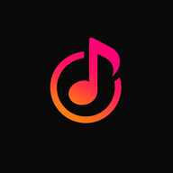
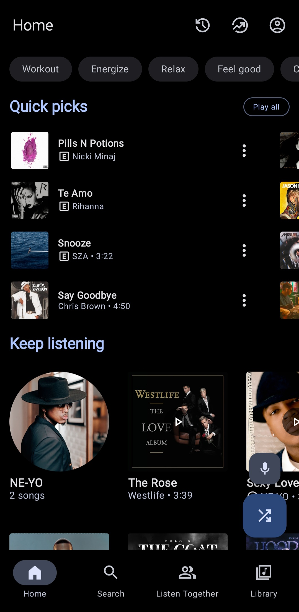
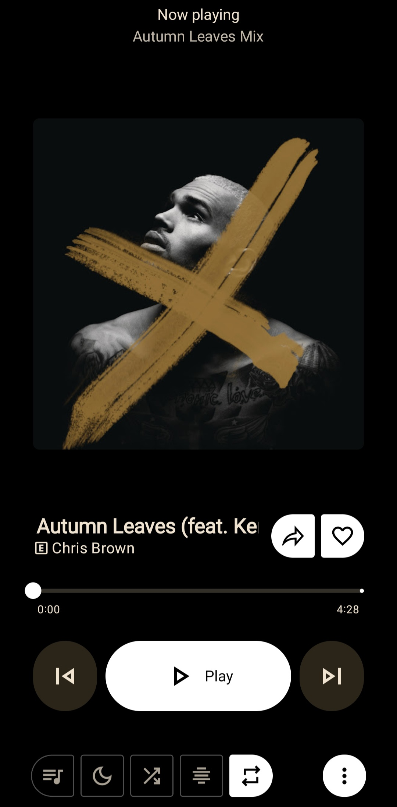
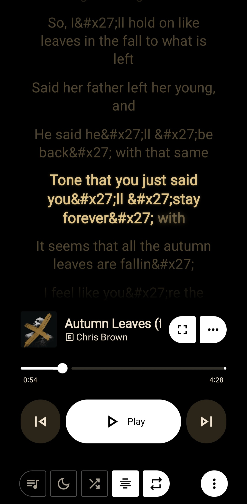
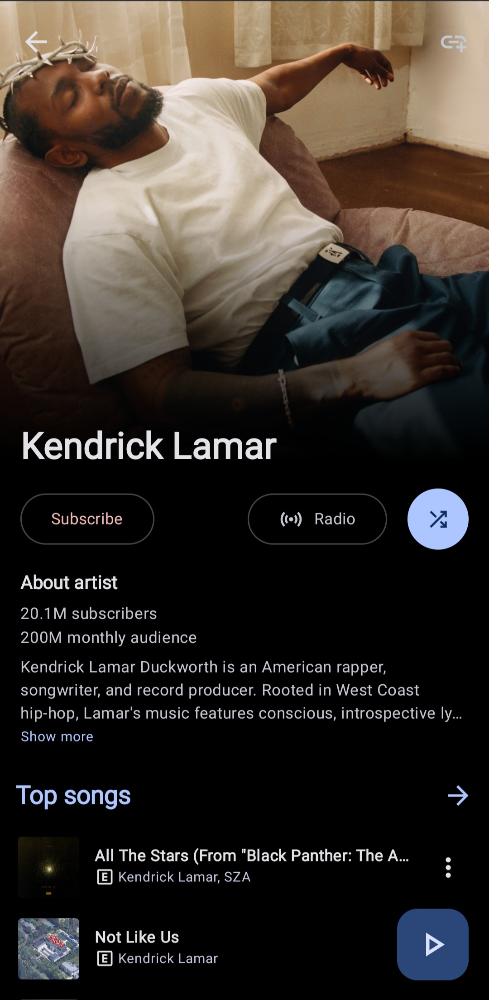
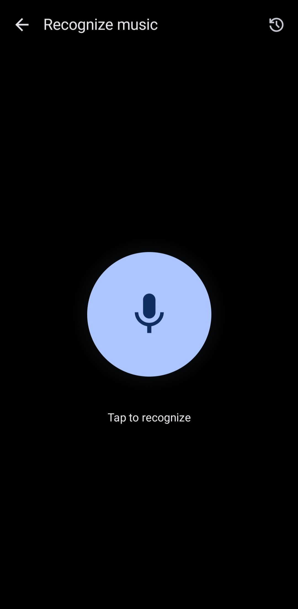
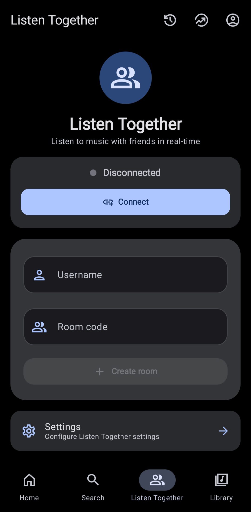

<div align="center">

<h1>NanzBeatles (Beatles)</h1>
<p>A modern Android music player with YouTube Music integration, powerful audio features, Google Cast support, voice control, and a beautiful Material 3 interface. Works seamlessly on **Android phones, Android TV, and Google TV**.</p>

<h1>Screenshots</h1>









<div align="center">
<h1>Release numbers</h1>
</div>

[](https://github.com/nanasmuda121/NanzBeatles/releases)
[](https://github.com/nanasmuda121/NanzBeatles/blob/main/LICENSE)
[](https://github.com/nanasmuda121/NanzBeatles/releases)

<table align="center">
<tr>
<td bgcolor="#ffffff" align="center">
<a href="https://trendshift.io/repositories/26041"></a>
</td>
</tr>
</table>

<br/>

[](https://hosted.weblate.org/engage/auramusic/)

<h3>We use Weblate to translate NanzBeatles. <a href="https://hosted.weblate.org/projects/auramusic/">Help us bring NanzBeatles to more people!</a></h3>

<a href="https://hosted.weblate.org/projects/auramusic/">
  
</a>

<h3>Thank you for helping translate NanzBeatles!</h3>

<h1>Join our community</h1>

<table align="center">
<tr>
<td align="center">
<a href="https://discord.gg/H6Nvy6Fs7Z">

</a>
<br>
<a href="https://discord.gg/H6Nvy6Fs7Z">Discord</a>
</td>
<td align="center">
<a href="https://t.me/NanzBeatlesUpdates">

</a>
<br>
<a href="https://t.me/NanzBeatlesUpdates">Telegram</a>
</td>
</tr>
</table>

</div>

<div align="center">
<h1>Download Now</h1>

<table>
<tr>
<td align="center">
<a href="https://github.com/nanasmuda121/NanzBeatles/releases/latest/download/NanzBeatles.apk"></a>
</td>
</tr>
</table>

</div>

<div align="center">
<h1>Table of Contents</h1>
</div>

- [Features](#features)
- [Tech Stack](#tech-stack)
- [Requirements](#requirements)
- [Quick Start](#quick-start)
- [Build Variants](#build-variants)
- [Support Me](#support-me)
- [Special Thanks](#special-thanks)

<div align="center">
<h1>Features</h1>
</div>

<table width="100%">
<tr>
<td width="50%" valign="top">

### Playback & Streaming
- Play any song or video from YouTube Music
- Background playback
- Download and cache songs for offline playback
- Search for songs, albums, artists, videos and playlists
- YouTube Music account login support
- Syncing of songs, artists, albums and playlists from and to your account

</td>
<td width="50%" valign="top">

### Audio Features
- Equalizer with custom presets
- Audio normalization
- Skip silence
- Adjust tempo/pitch
- Sleep timer
- VOSK wake word detection for hands-free voice control

</td>
</tr>
<tr>
<td width="50%" valign="top">

### Voice Control
- Hands-free voice commands (say "Hey Aura" to activate)
- AEC and noise suppression for accurate detection
- Voice feedback with TTS
- Control playback, volume, and search with your voice

</td>
<td width="50%" valign="top">

### Casting & Sharing
- **Google Cast support** (Chromecast to TV, speakers, Android TV)
- **Native Android TV / Google TV** app with D-pad navigation
- Listen together with friends in real-time
- Discord Rich Presence

</td>
</tr>
<tr>
<td width="50%" valign="top">

### Lyrics
- Live synchronized lyrics
- Multiple sources: Kugou, LRCLib, RushLyrics, BetterLyrics
- Word-by-word highlighting

</td>
<td width="50%" valign="top">

### Library & Organization
- Personalized quick picks
- Library management
- Local playlist management
- Import playlists
- Reorder songs in playlist or queue

</td>
</tr>
<tr>
<td width="50%" valign="top">

### UI & Themes
- Material 3 design
- Light - Dark - Black - Dynamic theme
- Home screen widget with playback controls

</td>
<td width="50%" valign="top">

### Integration
- Shazam music recognition
- Last.fm scrobbling

</td>
</tr>
</table>

<div align="center">
<h1>Tech Stack</h1>
</div>

- **Language:** Kotlin
- **UI:** Jetpack Compose + Material 3
- **Audio:** Media3 ExoPlayer
- **Voice:** VOSK offline speech recognition
- **DI:** Hilt
- **Database:** Room
- **Networking:** Ktor
- **Image Loading:** Coil
- **Casting:** Google Cast Framework

<div align="center">
<h1>Requirements</h1>
</div>

- Android 8.0+ (API 26) for phone
- Android 9.0+ (API 28) for Android TV / Google TV
- Android Studio Ladybug
- JDK 21

<div align="center">
<h1>Quick Start</h1>
</div>

```bash
# Clone the repository
git clone https://github.com/nanasmuda121/NanzBeatles.git
cd NanzBeatles

# Setup API keys (optional)
cp local.properties.example local.properties

# Build for phone
git checkout main
./gradlew assembleDebug

# Build for TV (Android TV / Google TV)
./gradlew assembleFossTvDebug
```

<div align="center">
<h1>Build Variants</h1>
</div>

| Variant | Description |
|---------|-------------|
| `foss` | F-Droid compatible, no Google Play Services |
| `gms` | With Google Cast support, voice features |

**ABI Variants:** universal, arm64, armeabi, x86, x86_64

**TV Build:** The `tv` flavor provides a native Android TV / Google TV experience with D-pad optimized navigation.

**Example commands:**
```bash
# Phone universal builds
./gradlew assembleFossUniversalRelease
./gradlew assembleGmsUniversalRelease

# TV universal builds  
./gradlew assembleFossTvUniversalRelease
./gradlew assembleGmsTvUniversalRelease
```

<div align="center">
<h1>Support Me</h1>
</div>

If you'd like to support my work, you can donate via PayPal or Liberapay:

<a href="https://www.paypal.com/cgi-bin/webscr?cmd=_donations&business=franklinfinyange%40gmail.com">

</a>
&nbsp;&nbsp;
<a href="https://liberapay.com/chila254/donate">

</a>

<div align="center">
<h1>Special Thanks</h1>
</div>

**InnerTune**
[Zion Huang](https://github.com/z-huang) • [Malopieds](https://github.com/Malopieds)

**OuterTune**
[Davide Garberi](https://github.com/DD3Boh) • [Michael Zh](https://github.com/mikooomich)

**Metrolist**
[MetrolistGroup](https://github.com/MetrolistGroup/Metrolist) – Original project this is based on

**Contributors**

<a href="https://github.com/nanasmuda121/NanzBeatles/graphs/contributors">
  
</a>

**Credits:**

- [**Kizzy**](https://github.com/dead8309/Kizzy) – Discord Rich Presence implementation
- [**RushLyrics**](https://github.com/shub39/Rush) – Additional lyrics data
- [**Better Lyrics**](https://better-lyrics.boidu.dev) – Time-synced lyrics with word-by-word highlighting
- [**SimpMusic Lyrics**](https://github.com/maxrave-dev/SimpMusic) – Lyrics data via SimpMusic API
- [**NanzBeatlesServer**](https://github.com/nanasmuda121/NanzBeatlesServer) – Listen together implementation
- [**MusicRecognizer**](https://github.com/aleksey-saenko/MusicRecognizer) – Music recognition and Shazam API
- [**Flow**](https://github.com/A-EDev/Flow) - Extract videos from YouTube 
- [**Vosk**](https://github.com/alphacep/vosk-api) - Offline wake word recognition
- [**Monochrome**](https://github.com/monochrome-music/monochrome) - Monochrome-inspired animated background and lyrics style
- [**SponsorBlock**](https://github.com/ajayyy/SponsorBlock) - Crowdsourced sponsor segment skipping
  
The open-source community for tools, libraries, and APIs that make this project possible.

<sub>Thank you to all the amazing developers who made this project possible!</sub>

<div align="center">
<h1>License</h1>
</div>

GNU General Public License v3.0 (GPL-3.0) - see [LICENSE](LICENSE) file

<div align="center">
<h1>Disclaimer</h1>
</div>

This project and its contents are not affiliated with, funded, authorized, endorsed by, or in any way associated with YouTube, Google LLC or any of its affiliates and subsidiaries.

Any trademark, service mark, trade name, or other intellectual property rights used in this project are owned by the respective owners.

**Made with ❤️ by [chila254](https://github.com/chila254)**
